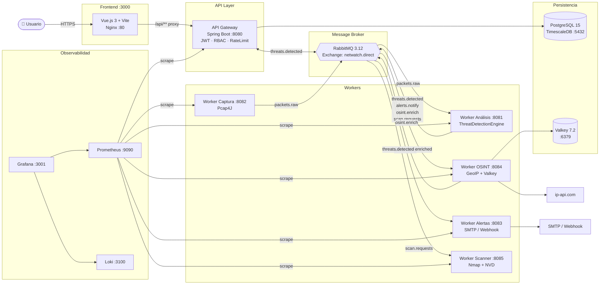
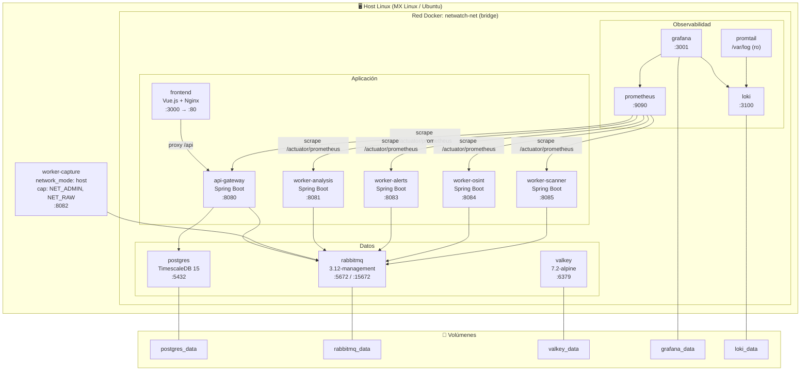
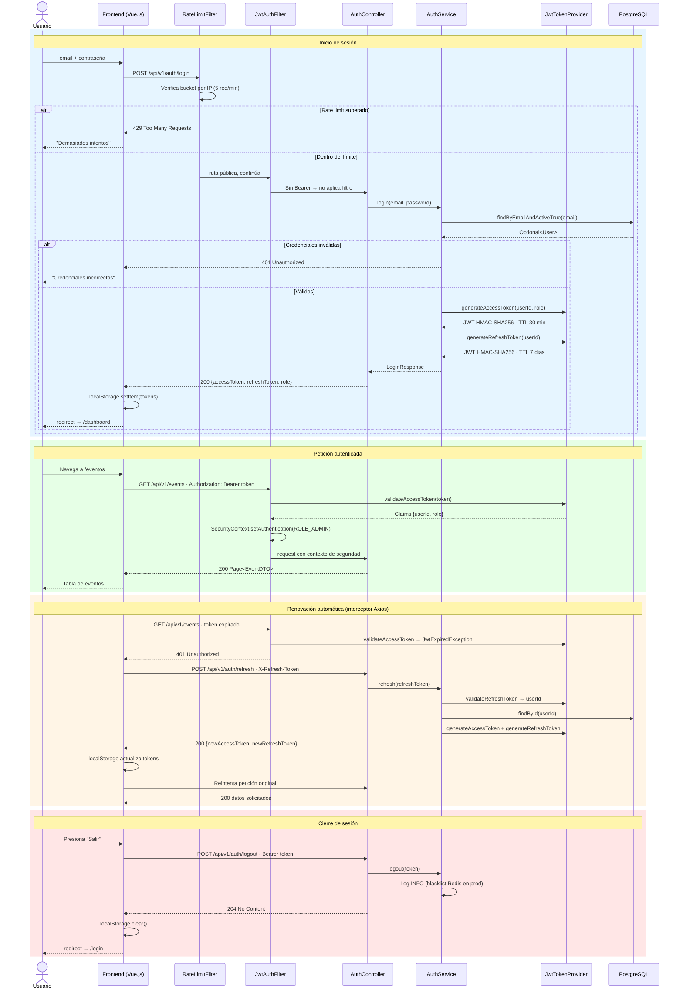
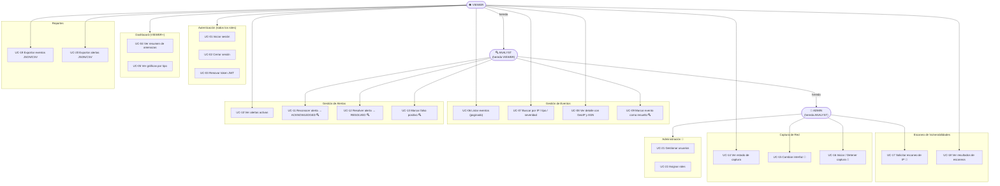

# Diagramas de Arquitectura — NetWatch

Los diagramas usan **Mermaid**, renderizado nativo en GitHub.  
Las fuentes UML originales en PlantUML están en los archivos `.puml` de esta carpeta.  
El modelo de amenazas está en [`threat-model.json`](threat-model.json) — se abre en <https://www.threatdragon.com/>.

---

## 1. Diagrama de Componentes

---

## 2. Diagrama de Despliegue

---

## 3. Diagrama de Secuencia — Autenticación JWT

---

## 4. Diagrama de Casos de Uso (RBAC)

> **Leyenda:** Sin marca = VIEWER · 🔍 = ANALYST · 🔑 = ADMIN exclusivo

---

## 5. Modelo de Amenazas STRIDE

Archivo: [`threat-model.json`](threat-model.json)  
Herramienta: **OWASP Threat Dragon** (sin registro en <https://www.threatdragon.com/>)  
→ *Open Existing Threat Model* → cargar el archivo JSON

| ID | STRIDE | Componente | Severidad | Contramedida |
|----|--------|-----------|-----------|--------------|
| T-01 | Spoofing | API Gateway / JWT | Alta | HMAC-SHA256 · TTL 30 min · refresh rotation |
| T-02 | Elevation of Privilege | API Gateway / RBAC | Alta | `@PreAuthorize` · roles en BD |
| T-03 | Repudiation | PostgreSQL | Media | Audit log inmutable con `created_at` |
| T-04 | Information Disclosure | API Gateway (respuestas) | Media | EventDTO enmascara campos por rol |
| T-05 | Tampering | API Gateway (entrada) | Alta | `@Valid` Bean Validation · HTTPS |
| T-06 | Tampering | RabbitMQ (mensajes) | Alta | Autenticación AMQP · TLS en prod |
| T-07 | Denial of Service | Worker Captura / API | Alta | RateLimitFilter Bucket4j · prefetch 20 |
| T-08 | Elevation of Privilege | Worker Captura (NET_RAW) | Crítica | Aislado en contenedor · Falco alert |
| T-09 | Information Disclosure | Worker OSINT → ip-api.com | Baja | Datos públicos · caché local TTL 1h |
| T-10 | Information Disclosure | Worker Alertas → SMTP | Baja | Credenciales en variables de entorno |
