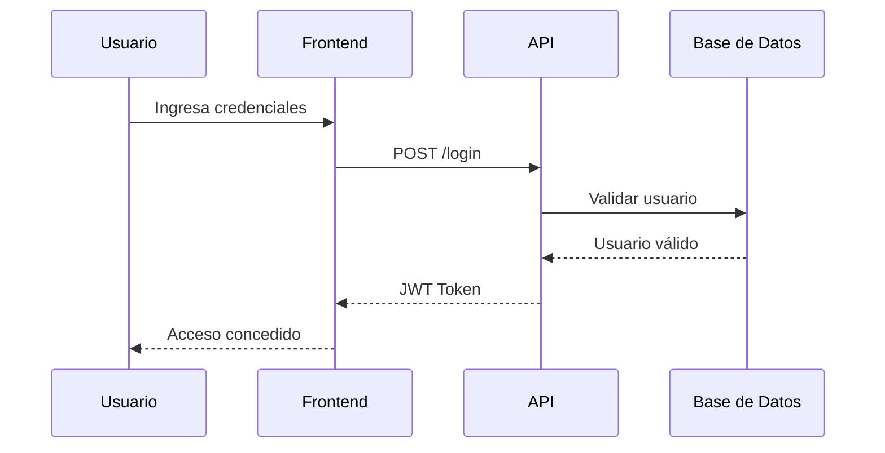

# 🔐 Flujo de Autenticación

Este diagrama describe el proceso de autenticación de usuarios mediante credenciales y generación de token JWT.

```mermaid
sequenceDiagram
    participant U as Usuario
    participant F as Frontend
    participant A as API
    participant DB as Base de Datos

    U->>F: Ingresa credenciales
    F->>A: POST /login
    A->>DB: Validar usuario
    DB-->>A: Usuario válido
    A-->>F: JWT Token
    F-->>U: Acceso concedido
```
