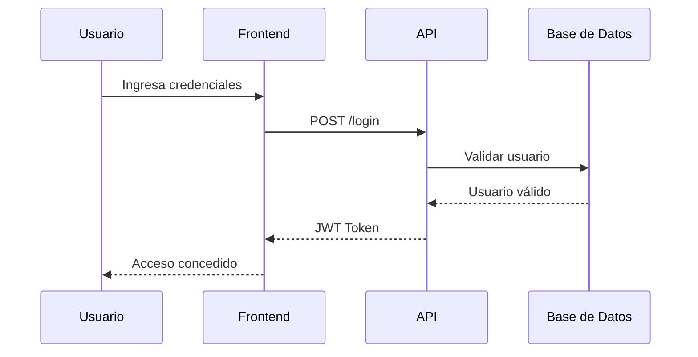

# 🔐 Flujo de Autenticación

Este diagrama describe el proceso mediante el cual un usuario accede al sistema de forma segura utilizando autenticación basada en tokens JWT.

## 🧠 Descripción del proceso

1. El usuario ingresa sus credenciales (correo y contraseña) en el frontend.
2. El frontend envía la solicitud al API Gateway.
3. El API valida las credenciales consultando la base de datos.
4. Si las credenciales son correctas, se genera un token JWT.
5. El token es enviado al frontend y almacenado para futuras solicitudes.
6. El usuario obtiene acceso al sistema.

Este mecanismo evita el uso constante de credenciales y mejora la seguridad del sistema.

