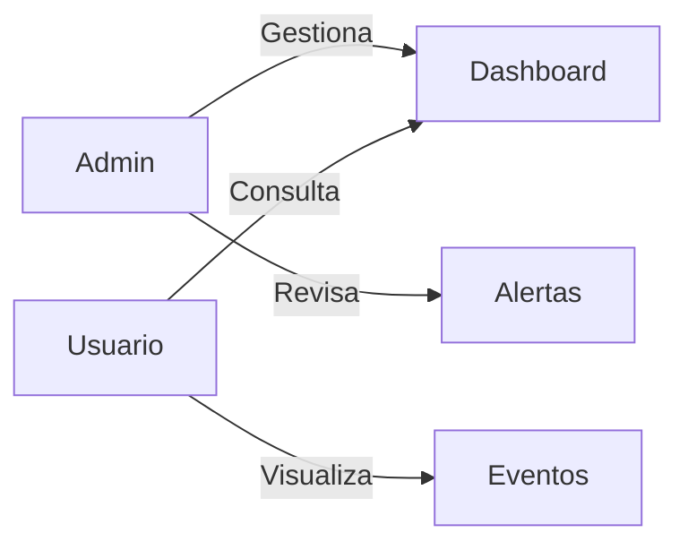

# 👥 Diagrama de Casos de Uso

Este diagrama representa los diferentes actores del sistema y las acciones que pueden realizar dentro de NetWatch.

## 🧠 Actores del sistema

- **Administrador:** Tiene control total sobre la plataforma, incluyendo configuración, monitoreo y gestión de usuarios.
- **Usuario:** Puede acceder al sistema para visualizar información y monitorear eventos.

## 🧠 Funcionalidades principales

- Visualización del dashboard
- Consulta de eventos de red
- Revisión de alertas de seguridad
- Configuración del sistema (solo administrador)

## 🔗 Relación con la aplicación

Las funcionalidades descritas en este diagrama se reflejan en la interfaz del usuario:

- Dashboard → visualización principal
- Eventos → listado de tráfico analizado
- Alertas → notificaciones de amenazas

El rol de administrador tiene acceso a configuraciones adicionales dentro del sistema.
