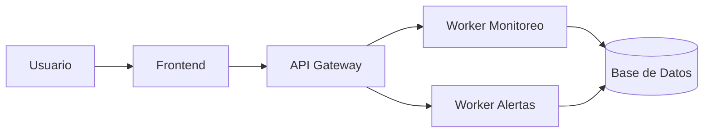
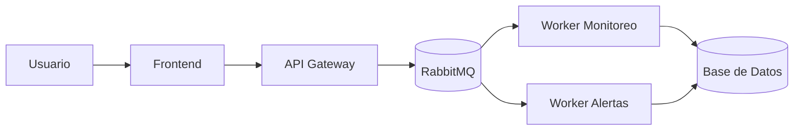

# 📐 Diagrama de Componentes (Microservicios)

Este diagrama muestra la arquitectura general del sistema NetWatch basada en microservicios.

# 📐 Diagrama de Componentes (Microservicios)

Este diagrama muestra la arquitectura del sistema NetWatch basada en microservicios, incluyendo comunicación asíncrona mediante RabbitMQ.

