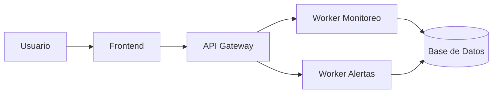

# 📐 Diagrama de Componentes (Microservicios)

Este diagrama representa la arquitectura lógica de NetWatch, basada en un enfoque de microservicios. Cada componente cumple una función específica dentro del sistema, permitiendo escalabilidad, mantenimiento independiente y mayor seguridad.

## Descripción de la arquitectura

- **Usuario:** Interactúa con el sistema a través del navegador web.
- **Frontend:** Interfaz gráfica que permite visualizar eventos, alertas y métricas del sistema.
- **API Gateway:** Punto central que recibe todas las solicitudes del frontend y gestiona la lógica del sistema.
- **RabbitMQ:** Broker de mensajes que permite la comunicación asíncrona entre servicios.
- **Workers:** Procesos independientes que ejecutan tareas específicas como monitoreo de red y generación de alertas.
- **Base de Datos:** Almacena la información procesada, incluyendo eventos detectados y registros históricos.

Esta arquitectura permite desacoplar los servicios, mejorando la resiliencia del sistema y facilitando la integración de nuevas funcionalidades.

## Diagrama

