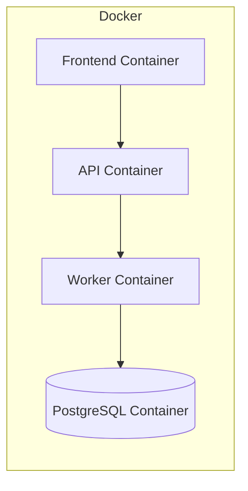

# 🐳 Arquitectura Docker

Este diagrama representa la estructura de contenedores utilizada para desplegar NetWatch.

```mermaid
flowchart LR
    subgraph Docker
        F[Frontend Container]
        A[API Container]
        W[Worker Container]
        DB[(PostgreSQL Container)]
    end

    F --> A
    A --> W
    W --> DB
```
