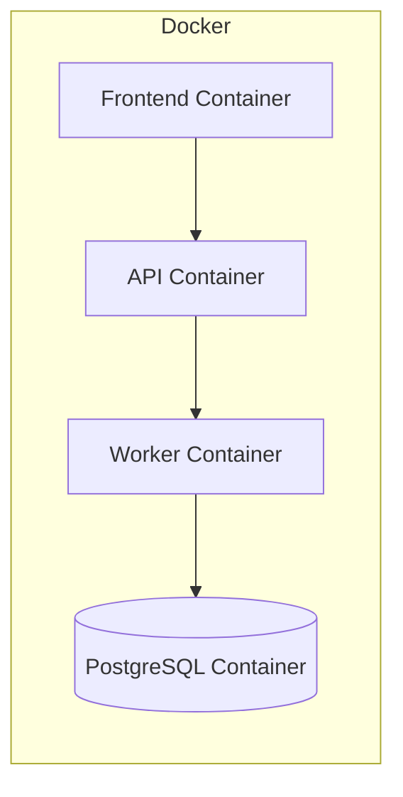

# 🐳 Arquitectura Docker

Este diagrama muestra cómo se despliega NetWatch utilizando contenedores Docker. Cada componente del sistema se ejecuta de forma aislada, lo que garantiza consistencia en cualquier entorno.

##  Descripción de la infraestructura

- **Frontend Container:** Ejecuta la interfaz web accesible desde el navegador.
- **API Container:** Gestiona las solicitudes y la lógica del sistema.
- **RabbitMQ Container:** Maneja la cola de mensajes entre servicios.
- **Worker Container:** Ejecuta tareas de monitoreo y análisis en segundo plano.
- **PostgreSQL Container:** Almacena todos los datos del sistema.

Todos los contenedores se comunican a través de una red interna de Docker definida en el archivo `docker-compose.yml`.

