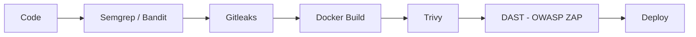

# 🔥 Flujo DevSecOps (OWASP)

Este diagrama representa el pipeline de integración continua y seguridad implementado en NetWatch, siguiendo buenas prácticas DevSecOps.

## 🧠 Descripción del pipeline

- **Plan:** Se realiza modelado de amenazas utilizando metodologías como OWASP y STRIDE.
- **Code:** Se analiza el código fuente con herramientas SAST como Semgrep y Bandit.
- **Secrets Scan:** Se detectan credenciales expuestas con Gitleaks.
- **Build:** Se construyen imágenes Docker.
- **Scan:** Se analizan vulnerabilidades en imágenes con Trivy.
- **Test:** Se ejecutan pruebas dinámicas (DAST) con OWASP ZAP.
- **Deploy:** Se despliega la aplicación en el entorno definido.
- **Monitor:** Se supervisa el comportamiento del sistema en producción.

Este enfoque permite detectar vulnerabilidades en cada fase del desarrollo.

## 🔗 Relación con el pipeline CI/CD

El flujo descrito se implementa en los workflows ubicados en:

- `.github/workflows/`

Herramientas utilizadas en el proyecto:

- **SAST:** Semgrep / Bandit
- **Detección de secretos:** Gitleaks
- **Escaneo de dependencias:** Trivy
- **Escaneo de imágenes Docker:** Trivy
- **DAST:** OWASP ZAP (carpeta `.zap/`)

El pipeline automatiza la detección de vulnerabilidades en cada cambio de código, evitando que errores de seguridad lleguen a producción.
