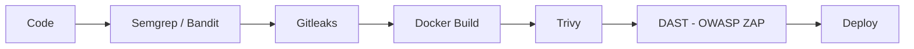

# 🔥 Flujo DevSecOps (OWASP)

Este diagrama representa el pipeline de seguridad implementado en el proyecto.

```mermaid
flowchart LR
    Code --> SAST[Semgrep / Bandit]
    SAST --> Secrets[Gitleaks]
    Secrets --> Build[Docker Build]
    Build --> Scan[Trivy]
    Scan --> Test[DAST - OWASP ZAP]
    Test --> Deploy
```
